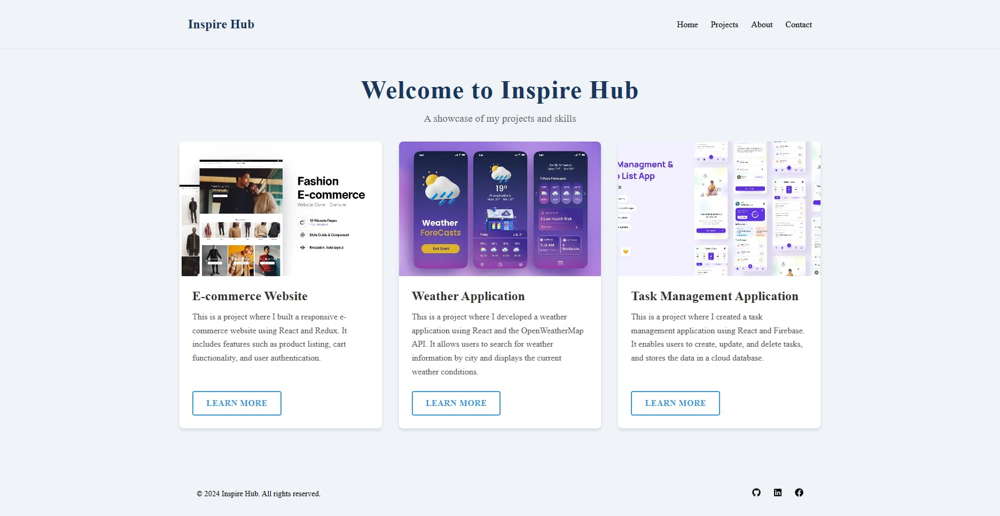
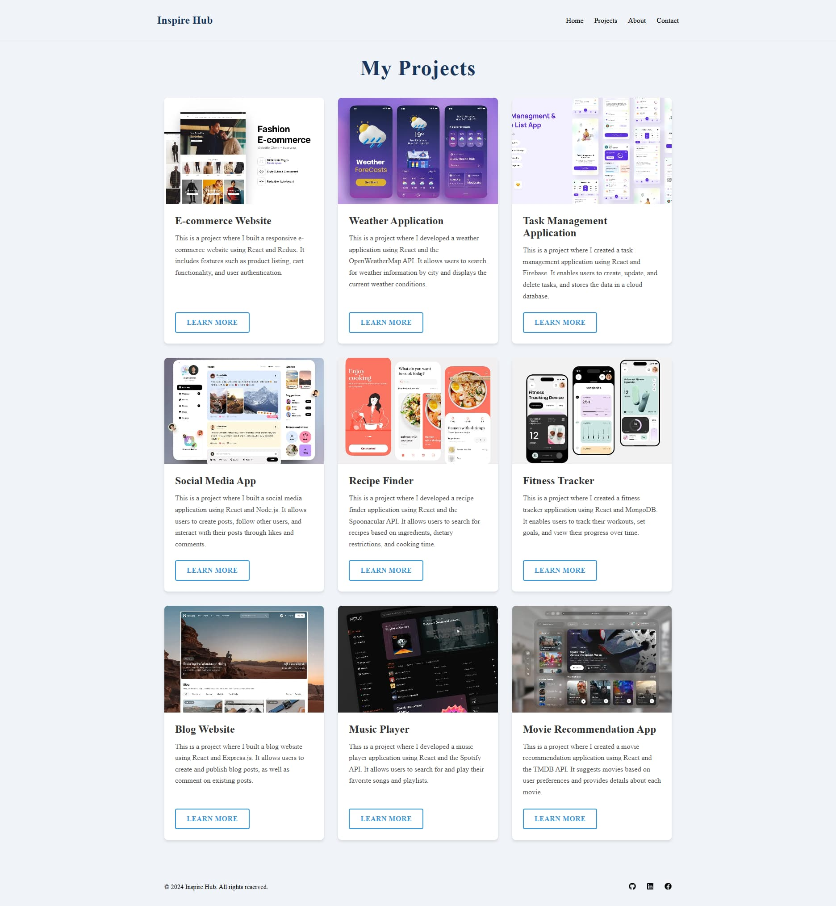
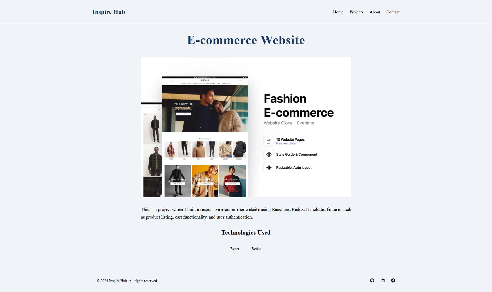
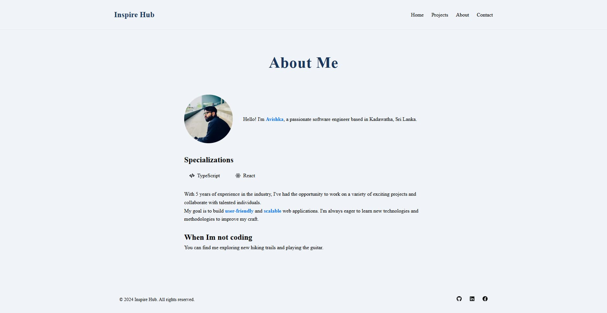
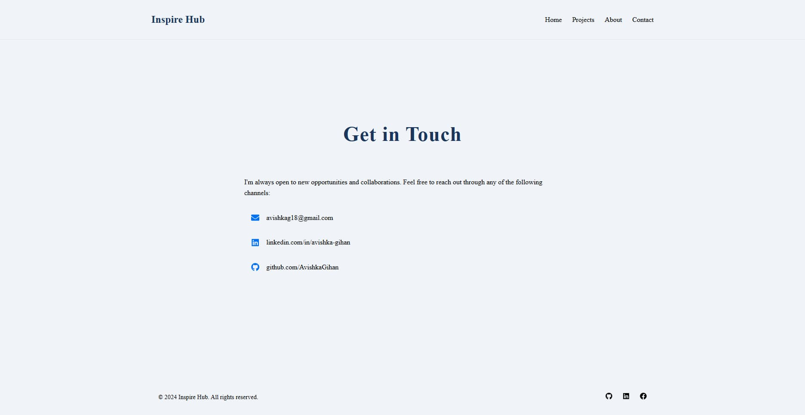

# Inspire Hub

Inspire Hub is a Next.js-based web application showcasing creative projects and ideas.

## Table of Contents

- [Inspire Hub](#inspire-hub)
  - [Table of Contents](#table-of-contents)
  - [Features](#features)
  - [Screenshots](#screenshots)
    - [Home Page](#home-page)
    - [Projects Page](#projects-page)
    - [Project Detail Page](#project-detail-page)
    - [About Page](#about-page)
    - [Contact Page](#contact-page)
  - [Getting Started](#getting-started)
    - [Prerequisites](#prerequisites)
    - [Installation](#installation)
  - [Usage](#usage)
  - [Project Structure](#project-structure)
  - [Technologies Used](#technologies-used)
  - [Contributing](#contributing)
  - [License](#license)
  - [Contact](#contact)

## Features

- Browse creative projects
- View detailed project information
- Responsive design for various devices
- Server-side rendering with Next.js

## Screenshots

### Home Page



### Projects Page



### Project Detail Page



### About Page



### Contact Page



## Getting Started

### Prerequisites

- Node.js (version 18.17.0 or later)
- npm, yarn, pnpm, or bun package manager

### Installation

1. Clone the repository:

   ```bash
   git clone https://github.com/AvishkaGihan/inspire-hub.git
   ```

2. Navigate to the project directory:

   ```bash
   cd inspire-hub
   ```

3. Install dependencies:

   ```bash
   npm install
   ```

## Usage

To run the development server:

```bash
npm run dev
# or
yarn dev
# or
pnpm dev
# or
bun dev
```

Open <http://localhost:3000> with your browser to see the result.

## Project Structure

- src/app: Next.js app router pages
- src/components: Reusable React components
- public: Static assets
- styles: CSS modules and global styles

## Technologies Used

- Next.js
- React
- TypeScript
- CSS Modules

## Contributing

Contributions are welcome! Please feel free to submit a Pull Request.

## License

This project is licensed under the MIT License.

## Contact

For any inquiries, please reach out to <avishkag18@gmail.com>.
